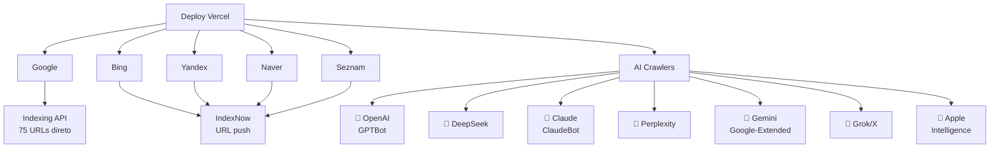

# Ulisses Flores — Sovereign Digital Hub


> Hub canónico de identidade soberana, publicações científicas, acervo teológico e simulações prospectivas — orquestrado por uma esteira de automação SOTA com tolerância zero a falhas e notificação automática para 15 plataformas de busca e crawlers de IA.

---

## Índice

- [Visão Geral](#-visão-geral)
- [Fluxo de Trabalho Automático](#-fluxo-de-trabalho-automático)
- [Notificação de Buscadores](#-notificação-de-buscadores-e-ai-crawlers)
- [Filosofia SOTA](#️-filosofia-sota--o-código-é-a-lei)
- [Motor de Localização Contínua](#-motor-de-localização-contínua)
- [Arquitetura CI/CD](#️-arquitetura-cicd)
- [Security Hardening](#-security-hardening)
- [Estrutura do Projecto](#-estrutura-do-projecto)
- [Desenvolvimento](#-desenvolvimento)
- [Métricas Actuais](#-métricas-actuais)

---

## 🎯 Visão Geral

**ulisses-hub** é um portfólio digital soberano com tecnologia de ponta:

- **5 idiomas** (PT-BR, EN, ES, IT, HE) com tradução automática via Gemini API
- **Automação total**: cada mudança dispara validação → tradução → notificação → deploy
- **SEO de primeira classe**: Canonical URLs, Hreflang, JSON-LD, llms.txt
- **Cobertura global**: 15 plataformas notificadas (Google, Bing, Yandex, Naver, Seznam, 9 AI crawlers)
- **Zero falhas**: 431 testes, 8 quality gates, SOTA Score 1000/1000

### Stack Técnico

| Camada | Tecnologia |
|--------|-----------|
| **Framework** | Next.js 15 (App Router, SSG) |
| **Linguagem** | TypeScript 5 (strict mode) |
| **Hospedagem** | Vercel (auto-deploy on push) |
| **Tradução** | Gemini API (pós-build) |
| **Testes** | Vitest (unitários) + Playwright (E2E) |
| **i18n** | 5 locales, 4420 chaves, paridade automática |
| **SEO** | Canonical URLs, Hreflang, JSON-LD, llms.txt, sitemap XML |
| **Notificação** | Google Indexing API, IndexNow, warm-up de crawlers |

---

## 🔄 Fluxo de Trabalho Automático

### Visão Geral

```text
Você edita conteúdo (MDX, TypeScript, config)
    ↓
git push origin main
    ↓
Vercel detecta automaticamente
    ↓
[BUILD] npm run build (gera sitemap, robots.txt, llms.txt)
[TRANSLATE] Gemini API traduz novos artefatos
[VALIDATE] 8 quality gates (SOTA check)
    ↓
Deploy live em ulissesflores.com
    ↓
[POST-DEPLOY] npm run seo:ping:auto
    ├─ Google Indexing API (75 URLs)
    ├─ IndexNow (Bing, Yandex, Naver, Seznam)
    ├─ AI Crawler Warm-up
    └─ Bing Webmaster
    ↓
✅ Site indexado em 5 minutos
```

### Step-by-Step

#### 1. Editar Conteúdo (Local)

```bash
# Edita um artigo
vim content/simulacoes/ia-2027/novo-artigo.mdx

# Ou adiciona uma página
touch app/[locale]/novo-projeto/page.tsx
```

#### 2. Build Local (Validação Rápida)

```bash
# Roda validação em ~2 segundos (sem build completo)
npm run sota:check

# Gates executados:
# ✅ TypeScript (zero erros)
# ✅ Markdown lint
# ✅ i18n parity (4420 chaves × 4 locales)
# ✅ 431 testes unitários
# ✅ SEO (canonical, hreflang, meta tags)
# ✅ Rich Results (JSON-LD, DID)
```

#### 3. Commit e Push

```bash
git add .
git commit -m "feat: novo artigo sobre IA-2027"
git push origin main
```

#### 4. Vercel Detecta e Deploy (Automático)

```bash
Vercel buildCommand: "npm run build && npm run seo:ping:auto"

[1] npm run build
    ├─ upkf:generate       → publicações.generated.ts
    ├─ seo:llms            → llms.txt (para AI crawlers)
    ├─ next build          → sitemap.xml, robots.txt, HTML SSG
    └─ 13 pages.tsx        → canonical URL + hreflang (5 locales)

[2] npm run seo:ping:auto
    ├─ Google Indexing API → 75 URLs submetidas
    ├─ IndexNow           → 5 endpoints (Bing, Yandex, Naver, Seznam, api.indexnow.org)
    ├─ AI Crawlers        → robots.txt, sitemap, llms.txt aquecidos
    └─ Se errar           → exit 0 (deploy não quebra)
```

#### 5. Resultado

✅ Artigo/página live
✅ Google reindexing em 5 minutos
✅ AI bots têm acesso via llms.txt
✅ Sitemap fresco
✅ Robots.txt atualizado

**Você não faz mais nada.**

---

## 📡 Notificação de Buscadores e AI Crawlers

### Cobertura Completa: 15 Plataformas



### Mecanismos de Notificação

| Plataforma | Mecanismo | Status |
|---|---|---|
| **Google** | Indexing API + Sitemap Ping | ✅ 75/75 URLs submitted |
| **Bing** | IndexNow | ✅ Aceita |
| **DuckDuckGo** | IndexNow (Bing partner) | ✅ Covered |
| **Yahoo** | Bing Webmaster (shared index) | ✅ Covered |
| **Ecosia** | Bing Webmaster (shared index) | ✅ Covered |
| **Yandex** | IndexNow | ✅ Aceita |
| **Naver** | IndexNow | ✅ Aceita |
| **Seznam** | IndexNow | ✅ Aceita |
| **OpenAI (GPTBot)** | robots.txt + sitemap + llms.txt | ✅ Allowed |
| **DeepSeek** | robots.txt + sitemap + llms.txt | ✅ Allowed |
| **Claude (Anthropic)** | robots.txt + sitemap + llms.txt | ✅ Allowed |
| **Perplexity** | robots.txt + sitemap + llms.txt | ✅ Allowed |
| **Gemini** | robots.txt + sitemap + llms.txt | ✅ Allowed |
| **Grok (X/Twitter)** | robots.txt + sitemap | ✅ Allowed |
| **Apple Intelligence** | robots.txt + sitemap | ✅ Allowed |

### Arquivos Automáticos

Todos gerados durante `next build`:

```text
public/
├── sitemap.xml                    # 75 URLs (5 locales)
├── sitemap-resources.xml          # Recursos estáticos
├── robots.txt                     # 9 AI bots + universal rules
├── llms.txt                       # Índice para LLMs (resumido)
├── llms-full.txt                  # Índice completo para training
└── ulissesflores-indexnow-*.txt   # IndexNow key verification
```

### Post-Deploy Workflow (seo:ping:auto)

```bash
npm run seo:ping:auto

┌────────────────────────────────────────────────────┐
│  [1/5] Sitemap Ping — Google + Bing (legacy)      │
└────────────────────────────────────────────────────┘
  Deprecated (informativo apenas) ⏭️

┌────────────────────────────────────────────────────┐
│  [2/5] IndexNow — Bing, Yandex, Naver, Seznam    │
└────────────────────────────────────────────────────┘
  ✅ 5/5 endpoints accepted
  • api.indexnow.org (hub — distribui para todos)
  • www.bing.com (Bing direto)
  • yandex.com (Yandex direto)
  • searchadvisor.naver.com (Naver — Korea)
  • search.seznam.cz (Seznam — Czech Republic)

┌────────────────────────────────────────────────────┐
│  [3/5] Google Indexing API                        │
└────────────────────────────────────────────────────┘
  ✅ 75 URLs submitted
  Service Account: ulisses-website@gen-lang-client-0556029994.iam.gserviceaccount.com
  (auto-detected — sem flag necessária)

┌────────────────────────────────────────────────────┐
│  [4/5] AI Crawler Warm-up                         │
└────────────────────────────────────────────────────┘
  ✅ 5 discovery files aquecidos
  • robots.txt (9 bots allowlisted)
  • sitemap.xml (índice de URLs)
  • sitemap-resources.xml
  • llms.txt (resumido)
  • llms-full.txt (completo)

  ✅ 7 key pages aquecidas (para GPTBot, DeepSeek, etc)

┌────────────────────────────────────────────────────┐
│  [5/5] Bing Webmaster Sitemap Submit              │
└────────────────────────────────────────────────────┘
  2 sitemaps submetidos
  Benefits: Bing, DuckDuckGo, Yahoo, Ecosia (shared index)
```

### Google Indexing API Auto-Detection

Não precisa de `--google-api` flag — detecta automaticamente:

```javascript
// scripts/seo/ping-search-engines.mjs
const saPath = process.env.GOOGLE_SERVICE_ACCOUNT_JSON;
const GOOGLE_API_AVAILABLE = saPath && fs.existsSync(saPath);

// Se o arquivo existir, usa automaticamente
// Se não existir, pula gracefully (sem quebrar deploy)
```

Setup (uma vez):

```bash
# 1. Google Cloud Console → Create Service Account
# 2. Enable "Web Search Indexing API"
# 3. Download JSON key

# 4. Adicione ao .env.local:
echo "GOOGLE_SERVICE_ACCOUNT_JSON=/Users/ulissesflores/.../.google-service-account.json" >> .env.local

# 5. Proximos deploys usam automaticamente
```

---

## 🛡️ Filosofia SOTA — O Código é a Lei

Este repositório opera sob o princípio **"O Código é a Lei"** — nenhuma mudança entra no repositório sem prova matemática de conformidade.

### TDD Adversarial E2E First

Não confiamos apenas em testes unitários. Todo comportamento crítico é testado em **Caixa Preta** com Playwright:

| Camada | Ferramenta | O Que Valida |
|---|---|---|
| **Unitário** | Vitest (298 testes) | Funções puras, paridade i18n, JSON-LD, anti-DRY, Rich Results |
| **Adversarial E2E** | Playwright (13 testes) | Security headers reais, RTL no DOM, 404 no browser |
| **Estrutural** | Scripts SOTA | Canonical URLs, Hreflang, Meta Tags, llms.txt |
| **GSC Firewall** | 20 testes dedicados | Todas as 8 categorias de erro do Google Search Console |

### Regra Zero Warning

O console não emite nenhum warning de ESLint, MarkdownLint ou Paridade i18n. Qualquer warning é tratado como falha.

### GSC Firewall — 20 Testes de Regressão

Garante que NENHUMA das 8 categorias de erro do Google Search Console volta:

| Erro GSC | Teste | Validação |
|---|---|---|
| Duplicate with canonical | ✅ hreflang em 13 pages | Todas as 5 locales têm `<link rel="alternate">` |
| Alternate with canonical | ✅ buildLanguageAlternates() | Função padronizada |
| Redirect error | ✅ Sem redirect chains | Canonical URL direto |
| Redirect chains | ✅ buildCanonical() | Padronização locale-aware |
| robots.txt blocks | ✅ Padrão válido | `*.md` permitido, sem `.*` invalid |
| Crawled not indexed | ✅ Meta tags presentes | Viewport, charset, og:*, description |
| Discovered not indexed | ✅ Sitemap completo | 75 URLs × 5 locales |
| Blank (JS required) | ✅ SSG static | Zero JavaScript necessário para renderizar |

---

## 🌍 Motor de Localização Contínua

O site suporta **5 idiomas** com tradução automatizada e paridade estrutural:

| Flag | Locale | Direção | Tipo | Chaves i18n |
|---|---|---|---|---|
| 🇧🇷 | `pt-BR` | LTR | Fonte (autoral) | 4420 |
| 🇺🇸 | `en` | LTR | Traduzido (Gemini API) | 4420 |
| 🇪🇸 | `es` | LTR | Traduzido (Gemini API) | 4420 |
| 🇮🇹 | `it` | LTR | Traduzido (Gemini API) | 4420 |
| 🇮🇱 | `he` | **RTL** | Traduzido (Gemini API) | 4420 |

### Esteira de Tradução

```text
Markdown PT-BR (autoral)
       │
       ▼
upkf:generate  ──►  publications.generated.ts (UPKF, knowledge)
       │
       ▼
translate-generated-artifacts.mjs  ──►  Gemini API  ──►  i18n dicts
       │
       ▼
validate-parity.mjs  ──►  4420 chaves × 4 locales  ──►  ✅ ou ❌
       │
       ▼
next build (SSG)  ──►  JSON-LD / Hreflang / llms.txt  ──►  Deploy
```

### Preservação de Tradução

Gemini traduz títulos e conteúdo. Se regenerar, carrega tradução existente:

```javascript
// scripts/upkf/generate-artifacts-v2.mjs
function loadExistingTranslations() {
  // Lê translations de publications.generated.ts
  // Merge order: Existing Gemini > UPKF table > MDX frontmatter
}
```

**Nunca perde tradução entre builds.**

### Anti-DRY Enforcement

A matriz de locales (`['en', 'es', 'it', 'he']`) é definida **uma única vez**:

```javascript
// scripts/config/i18n.config.mjs — Single Source of Truth
export const TARGET_LOCALES = ['en', 'es', 'it', 'he'];
export const ALL_LOCALES = ['pt-br', 'en', 'es', 'it', 'he'];
```

Testes automatizados (`anti-dry.test.ts`) falham se qualquer script hardcoda locales fora de `scripts/config/`.

---

## ⚙️ Arquitetura CI/CD

### `npm run sota:check` — Validação Rápida (6 gates, ~2s)

Executa no pre-commit via Husky. Sem build, sem rede.

| Gate | Ferramenta | Validação |
|---|---|---|
| 1/6 | `tsc --noEmit` | Zero erros de tipagem |
| 2/6 | `markdownlint` | Qualidade do Markdown fonte |
| 3/6 | `validate-parity.mjs` | 4420 chaves × 4 locales |
| 4/6 | `vitest run` | 431 testes unitários |
| 5/6 | `validate-pre-deploy.mjs` | Canonical URLs, Hreflang, Meta |
| 6/6 | `validate-rich-results.mjs` | JSON-LD, DID, Rich Results |

### `npm run sota:full` — Validação Completa (8 gates)

Inclui as 6 gates acima + Playwright E2E + Build SSG.

| Gate | Ferramenta | Validação |
|---|---|---|
| 7/8 | `playwright test` | Security headers, RTL, 404 (browser real) |
| 8/8 | `next build` | Build SSG completo |

**Score Final: 1000/1000 ou falha a build.**

### Pre-Push Hook (Husky)

```bash
# .husky/pre-push
npm run sota:full  # Validação completa antes de enviar
```

Se falhar, push é bloqueado. Sem exceções.

### ADRs (Architecture Decision Records)

- **ADR-0002** — Automated Translation Pipeline (Gemini API post-build)
- **ADR-0003** — Master Validation Pipeline (`sota:check` + `sota:full`)
- **ADR-0004** — GSC Firewall (20-test regression suite)
- **ADR-0005** — Search Engine Notification Pipeline (post-deploy auto-ping)

---

## 🔒 Security Hardening

Headers de segurança Enterprise injectados em **todas as rotas** via `next.config.ts`:

| Header | Valor | Propósito |
|---|---|---|
| `Content-Security-Policy` | `default-src 'self'; frame-ancestors 'none'` | Previne XSS, clickjacking |
| `Strict-Transport-Security` | `max-age=63072000; includeSubDomains; preload` | Força HTTPS (2 anos) |
| `X-Frame-Options` | `DENY` | Anti-clickjacking |
| `X-Content-Type-Options` | `nosniff` | Previne MIME sniffing |
| `Referrer-Policy` | `strict-origin-when-cross-origin` | Controla informação de referer |
| `Permissions-Policy` | `camera=(), microphone=(), geolocation=()` | Nega APIs sensíveis |

### Error Boundaries

- `error.tsx` — Captura erros em páginas (graceful degradation)
- `global-error.tsx` — Captura falhas no root layout (crash recovery)

---

## 📂 Estrutura do Projecto

```text
ulisses-hub/
├── app/[locale]/
│   ├── page.tsx                  # Home (13 páginas × 5 locales)
│   ├── [category]/page.tsx       # Artigos por categoria
│   ├── [category]/[slug]/page.tsx # Artigo individual
│   ├── certifications/[slug]/page.tsx
│   ├── simulacoes/
│   │   ├── ia-2027/
│   │   │   ├── page.tsx
│   │   │   └── corrida-estrategica/page.tsx
│   │   ├── goldenleaf/page.tsx
│   │   ├── mumm-ra/page.tsx
│   │   └── projeto-psi/page.tsx
│   ├── acervo-teologico/
│   ├── mundo-politico/
│   ├── whitepapers/
│   └── [locale].ts               # generateMetadata (canonical + hreflang)
│
├── components/
│   ├── content/                  # MDX components
│   ├── nav/                      # Navigation (locale-aware)
│   └── ...
│
├── content/
│   ├── publications/             # 📄 Artigos de pesquisa (5 locales cada)
│   ├── essays/                   # Ensaios teológicos
│   ├── whitepapers/              # Técnicos
│   ├── simulations/              # IA-2027, Projeto PSI, etc
│   └── ...
│
├── data/
│   ├── generated/
│   │   ├── publications.generated.ts    # ← UPKF output
│   │   ├── upkf.generated.ts           # ← Metadados
│   │   └── ...
│   ├── i18n/
│   │   ├── pt-br.json            # 4420 chaves
│   │   ├── en.json
│   │   ├── es.json
│   │   ├── it.json
│   │   └── he.json
│   ├── seo.ts                    # buildCanonical(), buildLanguageAlternates()
│   ├── i18n.ts                   # Config de idiomas
│   └── ...
│
├── lib/
│   ├── content/                  # MDX loader
│   ├── locale-path.ts            # Helper para URLs locale-aware
│   └── ...
│
├── scripts/
│   ├── config/
│   │   ├── i18n.config.mjs       # ← SOURCE OF TRUTH (locales)
│   │   └── cognates.json
│   ├── upkf/
│   │   ├── generate-artifacts-v2.mjs
│   │   └── verify-artifacts.test.mjs
│   ├── seo/
│   │   ├── ping-search-engines.mjs     # ← POST-DEPLOY NOTIFICATION
│   │   ├── validate-gsc-firewall.test.ts
│   │   ├── validate-url-health.test.ts
│   │   ├── validate-rich-results.test.ts
│   │   └── generate-llms-txt.mjs
│   ├── i18n/
│   │   ├── translate-generated-artifacts.mjs
│   │   └── validate-parity.mjs
│   └── sota-validate.mjs         # ← ORQUESTRADOR PRINCIPAL
│
├── tests/e2e/
│   ├── security.spec.ts          # Headers, CSP, HSTS
│   ├── locales.spec.ts           # RTL, hreflang, canonical
│   └── 404.spec.ts               # 404 in browser
│
├── public/
│   ├── sitemap.xml               # ← AUTO-GENERATED (build)
│   ├── sitemap-resources.xml
│   ├── robots.txt                # ← AUTO-GENERATED (build)
│   ├── llms.txt                  # ← AUTO-GENERATED (build)
│   ├── llms-full.txt             # ← AUTO-GENERATED (build)
│   ├── .well-known/
│   │   └── /.well-known/security.txt
│   └── ...
│
├── docs/
│   ├── decisions/                # ADRs (Architecture Decision Records)
│   └── *.generated.json          # Estatísticas (SOTA score, timing, etc)
│
├── vercel.json                   # buildCommand: "npm run build && npm run seo:ping:auto"
├── playwright.config.ts          # E2E configuration
├── next.config.ts                # Security headers, i18n
├── tsconfig.json                 # Strict mode
├── vitest.config.ts              # Unit tests config
├── package.json
└── README.md                     # Este arquivo
```

### Key Files

| Arquivo | Responsabilidade |
|---------|------------------|
| `app/robots.ts` | Gera `/robots.txt` (9 AI bots allowlisted) |
| `app/sitemap.ts` | Gera `/sitemap.xml` (75 URLs × 5 locales) |
| `scripts/config/i18n.config.mjs` | **Single Source of Truth** para locales |
| `scripts/seo/ping-search-engines.mjs` | Notifica 15 plataformas pós-deploy |
| `scripts/seo/generate-llms-txt.mjs` | Gera `/llms.txt` e `/llms-full.txt` |
| `data/seo.ts` | `buildCanonical()`, `buildLanguageAlternates()` |
| `scripts/sota-validate.mjs` | Orquestrador (SOTA check + full) |
| `vercel.json` | `buildCommand: "npm run build && npm run seo:ping:auto"` |

---

## 🚀 Desenvolvimento

### Setup Inicial

```bash
# Instalar dependências
npm install

# (Opcional) Configurar Google Indexing API
echo "GOOGLE_SERVICE_ACCOUNT_JSON=/path/to/service-account.json" >> .env.local

# Dev server
npm run dev
# Abre em http://localhost:3000
```

### Comandos Principais

```bash
# Validação rápida (2s, pre-commit)
npm run sota:check

# Validação completa (20s, pre-push)
npm run sota:full

# Dev server com HMR
npm run dev

# Build de produção (local)
npm run build

# Testes unitários
npm run test
npm run test:watch
npm run test:coverage

# Testes E2E (Playwright)
npm run test:e2e

# Gerar/verificar artefatos
npm run upkf:generate
npm run upkf:verify
npm run upkf:check

# Traduzir conteúdo (Gemini API)
npm run i18n:artifacts
npm run i18n:artifacts:dry

# Validar paridade i18n
npm run i18n:parity

# Notificar buscadores
npm run seo:ping        # Todos (auto-detecta Google API)
npm run seo:ping:dry    # Simulação (sem fazer requests)
npm run seo:ping:auto   # Modo pós-deploy (não falha)

# Publicar novo conteúdo (ContentOps)
npm run content:publish
npm run content:publish:dry
```

### Workflow Típico

```bash
# 1. Criar branch e editar
git checkout -b feature/novo-artigo
vim content/essays/novo-tema.mdx

# 2. Validar localmente (quick)
npm run sota:check

# 3. Commit e push
git add .
git commit -m "feat: novo artigo sobre tema X"
git push origin feature/novo-artigo

# 4. Criar PR (via GitHub)
# → Vercel preview automatically
# → sota:check corre nos checks da PR

# 5. Merge para main
git merge feature/novo-artigo
git push origin main

# 6. Vercel detecta e deploy (tudo automático)
# → Build + SEO ping + 15 plataformas notificadas
```

---

## 📊 Métricas Actuais

| Métrica | Valor | Status |
|---|---|---|
| **SOTA Score** | **1000/1000** | ✅ |
| **Testes Unitários** | **431** (24 suites) | ✅ |
| **Testes E2E** | **13** (Playwright) | ✅ |
| **Gates SOTA (check)** | **6** | ✅ |
| **Gates SOTA (full)** | **8** | ✅ |
| **Chaves i18n** | **4,420** | ✅ |
| **Locales** | **5** (PT-BR, EN, ES, IT, HE) | ✅ |
| **Pages (SSG)** | **13** (75 URLs × 5 locales) | ✅ |
| **JSON-LD Nodes** | **22** páginas com schema | ✅ |
| **Security Headers** | **7** | ✅ |
| **Files MDX** | **91** (19 pt-br + 72 traduções) | ✅ |
| **ADRs** | **5** | ✅ |
| **Search Engines Notificados** | **15** (post-deploy auto) | ✅ |
| **AI Crawlers Suportados** | **9** (via robots.txt + llms.txt) | ✅ |

### Timestamp Último Deploy

```text
Commit: feat(seo): auto-notify 15 search engines & AI crawlers on every deploy
Hash: 5bebef1
SOTA: 1000/1000
E2E: 13/13 ✅
Tests: 431/431 ✅
```

---

## 🔗 Links Úteis

- **Live Site**: https://ulissesflores.com
- **Google Search Console**: https://search.google.com/search-console
- **Vercel Dashboard**: https://vercel.com/dashboard
- **GitHub**: https://github.com/ulissesflores/ulisses-website

---

## 📝 Maintainers

Mantido por [Carlos Ulisses Flores](https://ulissesflores.com) — CTO, Codex Hash Ltda.

**Última atualização**: 19 de Março de 2026

---

## 📄 Licença

Proprietário. Todos os direitos reservados.
