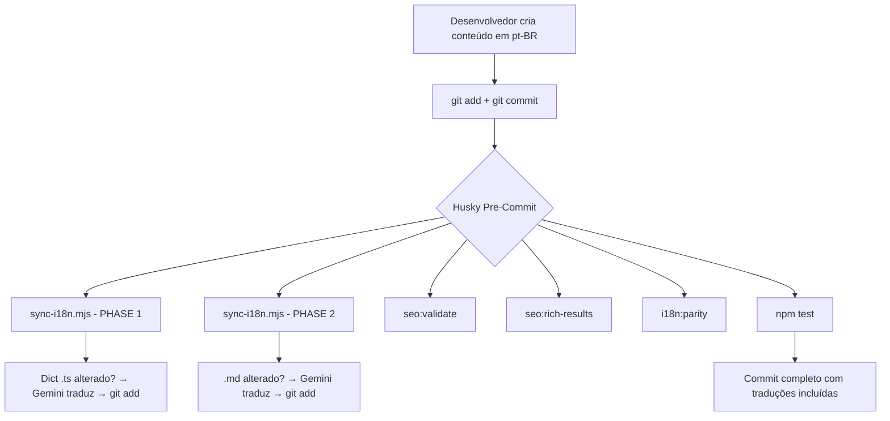

# 🌐 Fluxo de Trabalho de Internacionalização (i18n)

> **Contrato SOTA:** Este documento define as regras absolutas para criação de conteúdo multilíngue no projeto `ulissesflores.com`.

## Arquitetura



## Regra 1: Novas Páginas (React / JSX)

### ❌ NUNCA faça isto:

```tsx
<h1>Sobre Mim</h1>
<p>Eu sou um engenheiro de software.</p>
```

### ✅ SEMPRE faça isto:

```tsx
// 1. Extraia as chaves para data/i18n/pt-br/[namespace].ts
export const myPage = {
  title: 'Sobre Mim',
  description: 'Eu sou um engenheiro de software.',
} as const;

// 2. No componente, use useDict()
const dict = useDict('myPage');
<h1>{dict.title}</h1>
<p>{dict.description}</p>
```

**O que acontece automaticamente:**  
Ao dar `git commit`, o `sync-i18n.mjs` detecta a alteração em `data/i18n/pt-br/myPage.ts`, traduz via Gemini API para EN, ES, IT e HE, gera os ficheiros em `data/i18n/{locale}/myPage.ts`, e faz `git add` automático.

---

## Regra 2: Novos Artigos / Whitepapers (Markdown)

### Passo a Passo:

1. **Crie o ficheiro Markdown** na pasta correta:
   - Artigos de pesquisa: `public/research/YYYY-titulo-do-artigo.md`
   - Ensaios: `public/essays/YYYY-titulo-do-ensaio.md`
   - Sermões: `public/acervo-teologico/titulo/sermon.md`

2. **Escreva apenas em Português (pt-BR).**

3. **Faça `git add` e `git commit`.**

**O que acontece automaticamente:**
- O `sync-i18n.mjs` (PHASE 2) detecta o novo `.md` staged.
- Chama a API Gemini para traduzir automaticamente.
- Gera 4 variantes: `artigo.en.md`, `artigo.es.md`, `artigo.it.md`, `artigo.he.md`.
- Faz `git add` automático nos ficheiros gerados.
- O Next.js SSG pega as variantes no build e gera páginas localizadas.
- O Sitemap e `llms.txt` são atualizados dinamicamente.

---

## Pipeline Pre-Commit (Husky)

Cada `git commit` dispara **5 gates** automáticas:

| # | Gate | Script | Função |
|---|---|---|---|
| 1 | **sync-i18n** (Phase 1) | `sync-i18n.mjs` | Traduz dicionários `.ts` alterados |
| 2 | **sync-i18n** (Phase 2) | `sync-i18n.mjs` | Traduz Markdown `.md` alterados |
| 3 | **SEO Validate** | `seo:validate` | Valida metadados estruturados |
| 4 | **Rich Results** | `seo:rich-results` | Valida JSON-LD, DID, Schema.org |
| 5 | **Parity** | `i18n:parity` | Valida paridade de chaves i18n |
| 6 | **Tests** | `npm test` | Suite completa (224+ testes) |

> [!IMPORTANT]  
> O `sync-i18n.mjs` **nunca bloqueia** o commit. Se a API Gemini falhar, o commit prossegue com stubs.  
> O `i18n:parity` e `npm test` **bloqueiam** se detectarem erros críticos.

---

## Diretórios Monitorados

| Diretório | Tipo | Exemplo |
|---|---|---|
| `data/i18n/pt-br/*.ts` | Dicionários | `common.ts`, `home.ts`, `faq.ts` |
| `public/research/*.md` | Artigos | `2025-lstm-asset-prediction.md` |
| `public/essays/*.md` | Ensaios | `2024-theology-economic-order.md` |
| `public/acervo-teologico/**` | Sermões | `sermon.md` |
| `data/research/*.md` | UPKF / Artigos | `ulisses-flores-sovereign-upkf.md` |

## Configuração

```bash
# .env.local (obrigatório para traduções automáticas)
GEMINI_API_KEY=your-api-key-here
```

## Comandos Manuais

```bash
# Traduzir todos os dicionários (forçar)
node --env-file=.env.local scripts/i18n/sync-i18n.mjs --force

# Traduzir um namespace específico
node --env-file=.env.local scripts/i18n/sync-i18n.mjs --namespace=common

# Traduzir artigos Markdown manualmente
node --env-file=.env.local scripts/i18n/translate-md-via-gemini.mjs

# Validar paridade i18n
npm run i18n:parity

# Dry run (sem escrever ficheiros)
node --env-file=.env.local scripts/i18n/sync-i18n.mjs --force --dry-run
```
