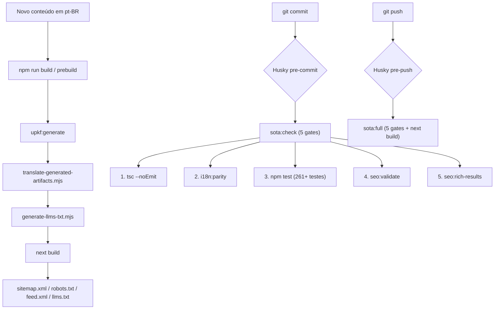

# 🌐 Fluxo de Trabalho de Internacionalização (i18n)

> **Contrato SOTA:** Este documento define as regras absolutas para criação de conteúdo multilíngue no projeto `ulissesflores.com`.
> Atualizado no **Lote 21** para refletir o Master Validation Pipeline (sota:check) e a arquitetura pós-Lote 18-B.

---

## ⚠️ Aviso Crítico: Turbopack e Scripts de Geração

> [!CAUTION]
> O watcher do Turbopack (`next dev --turbopack`) **reverte** ficheiros modificados externamente em tempo real.
> Isso significa que rodar scripts que alteram ficheiros `.generated.ts` ou dicionários i18n
> enquanto o servidor de desenvolvimento está ativo **vai causar perda de dados**.
>
> **REGRA ABSOLUTA:** Scripts de geração e tradução (`upkf:generate`, `i18n:artifacts`, `seo:llms`)
> devem ser rodados com o servidor de desenvolvimento **DESLIGADO**.
>
> O modo `--webpack` (`npm run dev`) não apresenta este problema, mas o modo `--turbopack`
> (`npm run dev:turbopack`) sim.

---

## Arquitetura do Pipeline



---

## Regra 1: Novas Páginas (React / JSX)

### ❌ NUNCA faça isto:

```tsx
<h1>Sobre Mim</h1>
<p>Eu sou um engenheiro de software.</p>
```

### ✅ SEMPRE faça isto:

```tsx
// 1. Extraia as chaves para data/i18n/pt-br/[namespace].ts
export const myPage = {
  title: 'Sobre Mim',
  description: 'Eu sou um engenheiro de software.',
} as const;

// 2. No componente, use useDict()
const dict = useDict('myPage');
<h1>{dict.title}</h1>
<p>{dict.description}</p>
```

**O que acontece automaticamente:**
O `prebuild` detecta novos textos no gerador de artefatos, traduz via Gemini API para EN, ES, IT e HE, e gera o conteúdo traduzido.

---

## Regra 2: Novos Artigos / Whitepapers

1. **Crie o ficheiro** na pasta correta (em Português pt-BR).
2. **Execute `npm run build`.** O `prebuild` gera → traduz → gera llms.txt → compila.
3. **Execute `npm run sota:check`** para garantir que tudo passa.
4. **Commit.** O husky roda `sota:check` automaticamente.

---

## Regra 3: RTL (Hebraico)

O locale `he` (Hebraico) usa layout Right-to-Left.
- A tag `<html>` recebe `dir="rtl"` automaticamente via `getDirection(locale)` no `layout.tsx`.
- A fonte Noto Sans Hebrew é carregada exclusivamente para `he`.
- Não use `width` fixo em containers de texto — use `max-width` com `overflow-x-auto` para tabelas.

---

## Pipeline Pre-Commit: `sota:check` (A Lei do Código — Lote 20)

Cada `git commit` dispara o **Master Validation Pipeline**:

| # | Gate | Script | Função | Tempo |
|---|---|---|---|---|
| 1 | **TypeScript** | `tsc --noEmit` | Tipagem estrita | ~0.3s |
| 2 | **i18n Parity** | `validate-parity.mjs` | 4420 chaves × 4 locales, 0 errors, 0 warnings | ~0.2s |
| 3 | **Test Suite** | `vitest run` | 264+ testes (charset HE, anti-cópia, SEO, i18n) | ~0.4s |
| 4 | **SEO Validate** | `validate-pre-deploy.mjs` | Canonical URLs, hreflang, meta tags | ~0.1s |
| 5 | **Rich Results** | `validate-rich-results.mjs` | JSON-LD, DID, Schema.org | ~0.1s |

> [!IMPORTANT]
> O `sota:check` **aborta no primeiro erro** (exit 1). Não há "warnings aceitáveis".
> Score exigido: **1000/1000**.

### Pre-Push: `sota:full`
Roda as mesmas 5 gates + `next build` (SSG completo).

---

## Pipeline de Build Automático

```bash
npm run build
#   1. upkf:generate          → gera publications.generated.ts, knowledge.generated.ts
#   2. translate-generated-artifacts.mjs → traduz campos faltantes via Gemini API
#   3. generate-llms-txt.mjs  → gera public/llms.txt dinâmico
#   4. next build              → SSG completo × 5 locales
```

> [!CAUTION]
> Em **produção** (VERCEL=1 / CI=true), a ausência da `GEMINI_API_KEY` causa **Hard Fail** (exit 1).
> Traduções faltantes em produção = deploy impedido. Configurar `GEMINI_API_KEY` nas env vars do provider.

---

## Configuração

```bash
# .env.local (obrigatório para traduções automáticas)
GEMINI_API_KEY=your-api-key-here
```

## Comandos Disponíveis

```bash
# ── SOTA (único ponto de validação) ──────────────────
npm run sota:check     # Roda 5 gates SEM build (pre-commit, ~2s)
npm run sota:full      # Roda 5 gates COM build (pre-push, ~60s)

# ── i18n ─────────────────────────────────────────────
npm run i18n:parity               # Validar paridade de chaves
npm run i18n:artifacts            # Traduzir artefatos gerados
npm run i18n:artifacts:dry        # Dry run (sem alterar ficheiros)
npm run i18n:full-check           # Generate + translate + parity

# ── SEO ──────────────────────────────────────────────
npm run seo:validate              # Canonical URLs, hreflang
npm run seo:rich-results          # JSON-LD, DID
npm run seo:llms                  # Gerar public/llms.txt

# ── Build ────────────────────────────────────────────
npm run build                     # Pipeline completo (generate → translate → llms → next build)
```
